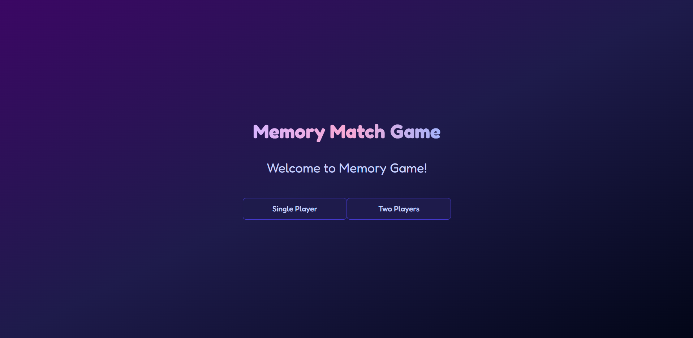

# 🎮 Memory Match Game  
*A fun and interactive memory game built with Next.js, React, and Tailwind CSS.*  

 <!-- Replace with correct image path -->

## 🚀 Live Demo  
🔗 **[Play Now](https://me-mory-game.vercel.app/)** 

---

## 📜 **About the Project**  
Memory Match Game is a card-flipping game where players test their memory by matching pairs of identical icons. It supports both **Single Player** and **Two-Player modes**, with a fun **confetti effect** when all pairs are matched.  

**Features:**  
✅ **Next.js 14** with App Router  
✅ **Framer Motion** animations  
✅ **Dark & Light Mode Support**  
✅ **Dynamic Player Names & Scores**  
✅ **Confetti Celebration on Winning**  

---

## 📂 **Project Structure**  
```
rsayyed591-memory-game/
├── public/               # Static assets (images, icons, etc.)
└── src/
    ├── app/              # Next.js App Router files
    │   ├── globals.css   # Global styles (Tailwind CSS)
    │   ├── layout.tsx    # Root layout file
    │   └── page.tsx      # Home page
    ├── components/
    │   ├── memory-game.tsx  # Game logic & UI
    │   └── ui/              # Reusable UI components
    │       ├── button.tsx
    │       ├── card.tsx
    │       ├── dialog.tsx
    │       └── input.tsx
    └── lib/
        └── utils.ts      # Utility functions
```

---

## 🛠 **Tech Stack**  
- **Frontend:** Next.js 14, React, TypeScript  
- **Styling:** Tailwind CSS  
- **Animations:** Framer Motion  
- **Game Logic:** React State & Hooks  

---

## 🖥 **Installation & Setup**  
### 1️⃣ Clone the Repository  
```sh
git clone https://github.com/rsayyed591/memory-game.git
cd memory-game
```

### 2️⃣ Install Dependencies  
```sh
npm install  # or yarn install
```

### 3️⃣ Run the Development Server  
```sh
npm run dev  # or yarn dev
```
🔗 Open [http://localhost:3000](http://localhost:3000) in your browser.  

---

## 🎨 **Customization**  
### 🔠 Change Font  
Modify `globals.css` in `src/app/`:
```css
@import url("https://fonts.googleapis.com/css2?family=Fredoka:wght@300;400;500;600;700&display=swap");
body {
  font-family: "Fredoka", sans-serif;
}
```

### 🎨 Change Colors  
Edit the Tailwind CSS variables in `globals.css`:
```css
@layer base {
  :root {
    --background: 240 100% 98%;
    --primary: 200 70% 50%;
    --secondary: 340 75% 55%;
    --accent: 43 74% 66%;
  }
}
```

---

## 👤 **Author**  
**Rehan Sayyed**  
📧 Email: [rehansayyed591@gmail.com](mailto:rehansayyed591@gmail.com)  
🌐 GitHub: [@rsayyed591](https://github.com/rsayyed591)  

---

## 🤝 **Contributing**  
We welcome contributions! Here's how you can help:  

1. **Fork the repository**  
2. **Create a new branch** (`git checkout -b feature-branch`)  
3. **Make your changes** and commit them (`git commit -m "Add new feature"`)  
4. **Push to GitHub** (`git push origin feature-branch`)  
5. **Open a Pull Request**  

Feel free to report issues, suggest improvements, or add new features! 🚀  

---

## 📝 **License**  
This project is licensed under the **MIT License**. See the [LICENSE](LICENSE) file for details.  

---

🚀 **Have fun playing & coding!** 🎮✨  